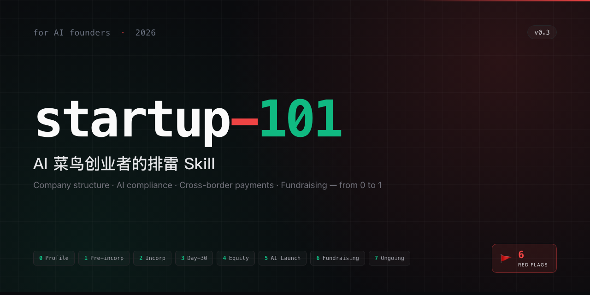

<p align="center">
  
</p>

# startup-101

> A minesweeper Claude Code Skill for first-time AI founders — covers 0→1 from "I want to start a company" to "I've closed my first round", cross-border native.

> **中文**: see [README.md](./README.md) — this skill is primarily written for Chinese-background AI founders; the English README is a pointer for international users who encounter it in a marketplace. **Roadmap**: see [ROADMAP.md](./ROADMAP.md).

## What this is

**startup-101** is a [Claude Code](https://claude.com/claude-code) Skill that helps first-time AI founders (engineers / researchers who have never incorporated a company) navigate the operational, legal, and financial minefield of launching an AI startup.

It is **not** a general-purpose "how to start a company" tool. It is specifically tuned for:

- **Chinese-background AI founders** (Mainland / HK / SG / US with Chinese tax residency implications)
- **AI-specific compliance** (algorithm filing, large-model filing, GDPR / EU AI Act / PIPL)
- **Cross-border from day one** (offshore structures, USD + CNY fundraising, international payments)

Non-Chinese founders building in the US / EU may find some modules useful (YC SAFE breakdown, EU AI Act GPAI obligations, Delaware flow) but other sections (37号文, PIPL outbound, domestic filing three-track) will not apply.

## What it covers

- **Company structures**: domestic LLC / VIE / Cayman / Delaware / Singapore — which one, why
- **AI compliance**: algorithm filing / large-model filing / registration (three tracks in China)
- **Cross-border payments**: Stripe / Paddle / Airwallex / Mercury wiring
- **Compliance stacking**: PIPL outbound + GDPR + EU AI Act overlapping obligations
- **Fundraising terms**: buyback / performance bets / anti-dilution red lines
- **High-mortality pitfalls**: 37号文, IP Assignment, personal payment collection, Llama license, AGPL, EU Art.27 representatives

## Seven-stage framework

| Stage | Name | Trigger | Key output |
|---|---|---|---|
| 0 | Profile | New user | A/B/C archetype routing |
| 1 | Pre-incorporation | Not registered yet | Cofounder agreement / equity / arch choice |
| 2 | Incorporation | Architecture decided | License + bylaws + bank account |
| 3 | Day-30 | License in hand | Tax registration / bookkeeping / invoicing / social insurance |
| 4 | Hiring & Equity | Building a team | ESOP / labor contracts / IP Assignment |
| 5 | AI Launch | Product going live | Filings / GDPR / AI Act / PIPL outbound |
| 6 | Fundraising | Seeking capital | BP / termsheet / SAFE / red flags |
| 7 | Ongoing | Post-close | Monthly / quarterly / annual obligations |

## Three archetypes

| Archetype | Criteria | Recommended path |
|---|---|---|
| **A. Pure domestic (CN)** | ≥70% CN users + not raising USD + not subscription-based cross-border | Domestic LLC → China compliance → RMB funds |
| **B. Cross-border dual-layer (default)** | R&D in China + global users or USD fundraising | Cayman/SG + WFOE / Delaware + HK / 37号文 + ODI |
| **C. Founder already offshore** | Founder in HK/SG/US, distributed R&D | Pure Delaware C-corp / SG Pte Ltd / Mercury / QSBS |

## Six red flags (scan anytime)

1. **37号文 not filed** — Chinese resident holding offshore SPV of domestic equity → dividends/exit can't repatriate
2. **IP Assignment not pointing to offshore entity** — fundraising DD blowup
3. **Personal PayPal / WeChat collecting subscription at scale** — >$50k/year → illegal forex conversion risk
4. **Llama Community License violation** — 700M MAU cap / no training-other-LLMs clause
5. **AGPL contamination** — forced open-sourcing of SaaS code
6. **No EU Art. 27 representative** — any EU user requires an EU representative

## Installation

```bash
# Clone the repo
git clone https://github.com/BENZEMA216/startup-101 ~/startup-101

# Symlink the skill into your Claude Code skills directory
cd ~/.claude/skills
ln -s ~/startup-101/.claude/skills/startup-101 startup-101
```

## Usage

```
/startup-101                # Default: profile → stage self-diagnosis
/startup-101 profile        # Profile routing only
/startup-101 stage N        # Jump directly to stage N (1-7)
/startup-101 redflags       # Run the 6-item red flag scan
/startup-101 checklist      # Generate complete checklist from profile
/startup-101 refs <topic>   # Query reference materials
```

The skill converses **bilingually** — users can chat in Chinese or English, and the skill responds in kind.

## Directory structure

```
startup-101/
├── README.md / README_EN.md     # Chinese main / English (this file)
├── CHANGELOG.md                 # Version history
├── LICENSE                      # MIT
├── .claude-plugin/              # Marketplace plugin metadata
├── .claude/skills/startup-101/
│   └── SKILL.md                 # Router entry (<400 lines)
├── modes/
│   ├── _shared.md               # Global rules (7 stages / 6 red flags / profile linkage contract)
│   ├── _profile.template.md     # Profile schema v0.3
│   ├── stage-0 ... stage-7.md   # Stage flow files
│   └── red-flags.md             # 6 red flag detectors
├── appendix/                    # Decision matrices (entity / payment / compliance / case studies / glossary)
└── references/                  # bundled/ structured summaries + index/ URL digests
```

## Disclaimer

1. **Not legal / accounting / tax advice.** Framework and checklists only.
2. **All concrete decisions must be verified by a licensed professional** in the relevant jurisdiction.
3. **Policies change fast** (especially AI compliance, cross-border data, EU AI Act) — cross-check the latest official sources.
4. The skill only covers 0→1: "I want to build" to "first round closed." Series B+ is out of scope.

## Acknowledgements

This skill stands on the shoulders of many public resources:

- **Shi Tou (石头看未来) / Jinqiu Capital** — *Fundraising Guide for Young AI Founders* (primary structure for Stage 6)
- **Y Combinator**: Startup School, YC Library, SAFE documents
- **a16z**: AI Canon, Emerging Architectures for LLM Applications, 16 Startup Metrics
- **Sequoia Capital**: Pitch Deck Template, Sonya Huang's Generative AI series
- **Stripe Atlas Guides** & **Cooley GO** templates
- **Index Ventures** Option Plan Handbook
- **Paul Graham** / **Sam Altman** essays
- Chinese law firms' AI compliance whitepapers: Zhong Lun (中伦), Han Kun (汉坤), AllBright (锦天城)

Full citation list in `references/` directory. Each reference retains its original license.

## Contributing

Target audience is Chinese-background AI founders, but pull requests welcome for:

- Additional case studies (more public companies — especially Archetype C variants)
- Reference index additions (with clear license status)
- Policy updates as rules evolve (e.g. new CAC filings, EU AI Act amendments)
- English / other language translations of individual stage files

## License

MIT. Each bundled reference retains its original author's license.

## Links

- Chinese README: [README.md](./README.md)
- Changelog: [CHANGELOG.md](./CHANGELOG.md)
- Marketplace submission status: [MARKETPLACE_SUBMISSION.md](./MARKETPLACE_SUBMISSION.md)
- Design doc: (internal spec — `/Users/benzema/docs/superpowers/specs/2026-04-15-startup-101-design.md`)
